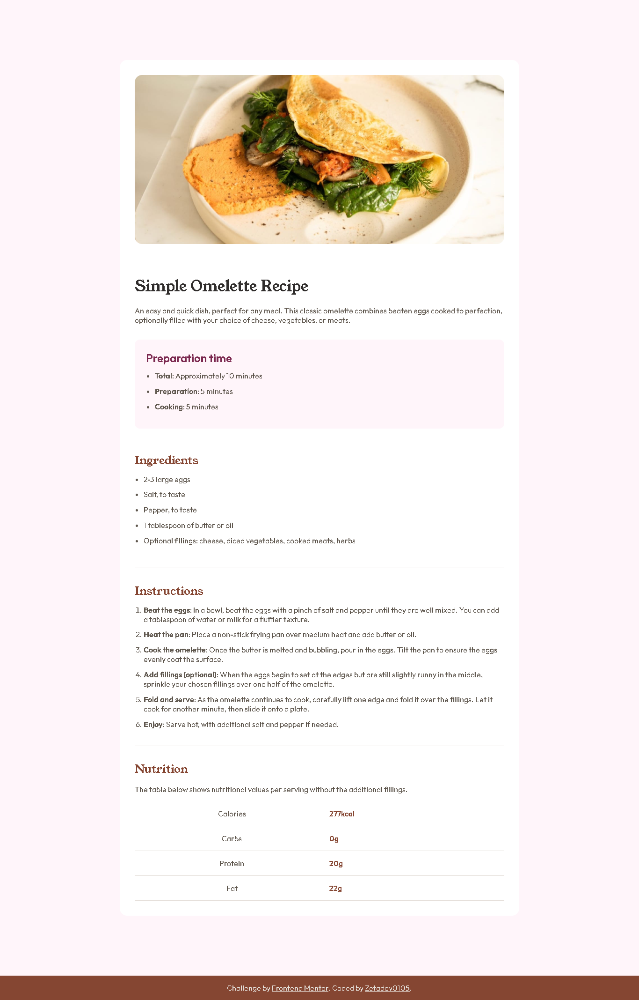

# Frontend Mentor - Recipe Page Solution

This is my solution to the **Recipe Page** challenge from Frontend Mentor. This project helped me continue improving my HTML and CSS skills while focusing on writing semantic, accessible, and responsive code.

## 📸 Screenshot

## 🔗 Links

* **Solution URL:** **
* **Live Site URL:** **

## 🚀 Built With

* Semantic **HTML5**
* **CSS3**
* Mobile-first workflow
* Responsive design with media queries
* BEM naming methodology
* Git & GitHub for version control
* GitHub Pages for deployment

## 💡 What I Learned

Although this challenge looks simple at first glance, it taught me several important concepts.

During this project I learned:

* How to build semantic tables using `th` and the `scope="row"` attribute.
* A better understanding of HTML lists and their elements.
* How to create responsive layouts using media queries.
* How to improve accessibility by writing meaningful `alt` text for images.
* How to organize CSS classes using the BEM methodology.
* How to build a responsive page following a mobile-first approach.

One of the biggest lessons came from a mistake I made. While styling the nutrition table, I couldn't understand why the bottom borders weren't behaving as expected. That led me to learn about the `border-collapse` property and how tables render their borders.

## 🛠️ My Process

I started by building the HTML structure before writing any CSS. While doing so, I carefully reviewed the document structure to make it as semantic as possible and iterated on it to improve accessibility and code quality.

Once the HTML was complete, I moved on to the CSS. I compared my implementation with the provided design throughout the process to achieve a layout as close as possible to the original. I followed a mobile-first workflow and later added media queries for larger screens.

The most challenging part of this project was understanding how HTML tables work and how to style them correctly. Solving those challenges helped me gain a much deeper understanding of semantic HTML.

## 🌱 Continued Development

In future projects I want to continue improving:

* Semantic HTML structure.
* CSS architecture and organization.
* Responsive layouts.
* Accessibility best practices.
* Writing cleaner and more maintainable code.

## ✨ Final Thoughts

This project reminded me that even challenges that seem simple at first can hide valuable learning opportunities. Every obstacle I encountered forced me to understand the underlying concepts better, making me a stronger developer.

I believe that consistently practicing small projects like this is one of the best ways to improve as a frontend developer.

## 👤 Author

* GitHub - **Zetadev0105**
* Frontend Mentor - **

